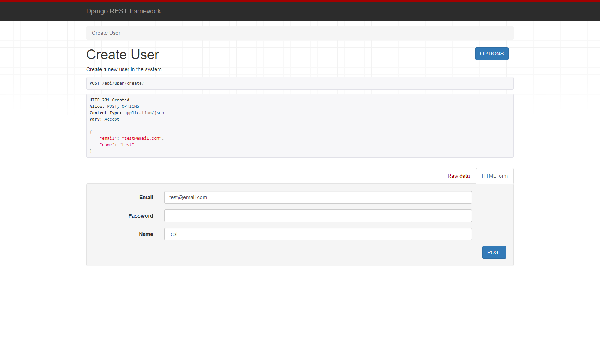
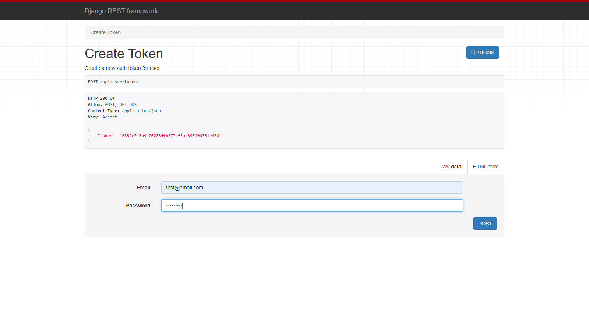
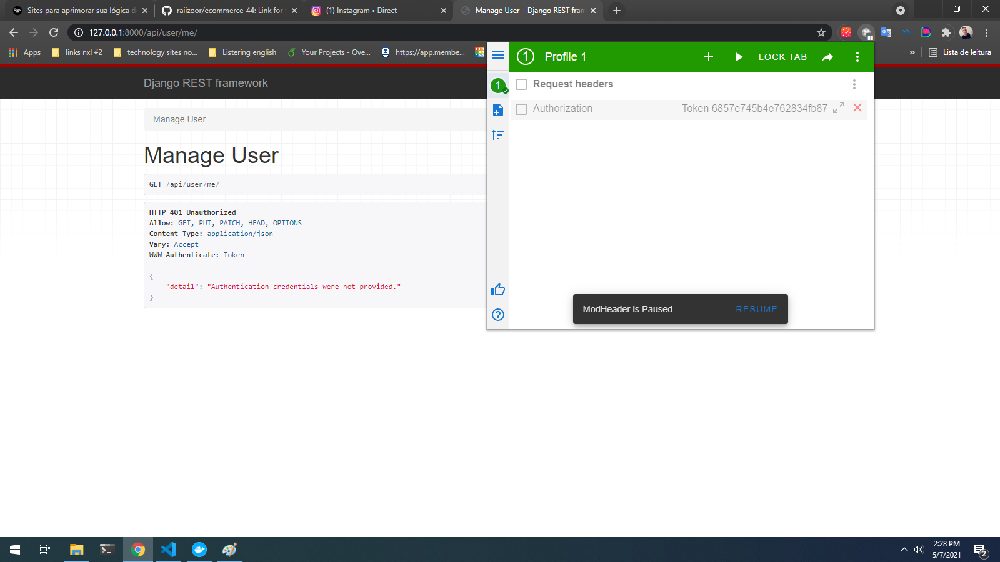
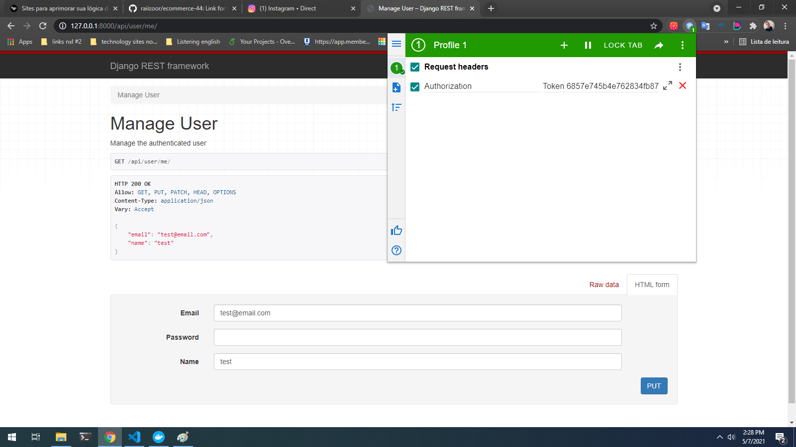
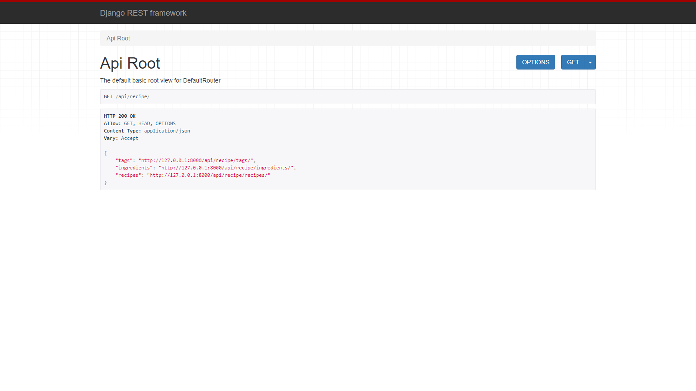

# Course from udemy - ApiRestFull-with-django 🚀

<h4>Create an advanced REST API with Python, Django REST Framework and Docker using Test Driven Development (TDD)<h4>


<h4> What I lerned 👨‍💻</h4>

* Setting up a local development server with Docker
* Writing a Python project using Test Driven Development
* Building a REST API with advanced features such as uploading and viewing images

* Creating a backend that can be used a base for your future projects or MVP

* Hands on experience applying best practice principles such as PEP-8 and unit tests

* Configure Travis-CI and Git-workflow to automate code checks

<h4>How to run that Api in your computer :hammer_and_wrench:</h4>

* you will need have instaled [docker](https://www.docker.com/get-started)

* Inside the directory excute command in your terminal
```sh
#step 1
docker build .

#step2
docker-compose build

#step3 - for see tests
docker-compose run --rm app sh -c "python manage.py test && flake8"

#step4 - to run 
docker-compose up

#open you browse and digite your localhost:8000 - example 127.0.0.1:8000
```

<h4>Screens Apis 🖼️</h4>

* Register user login :robot:



| [ Token ](images/token.png) | [ Update user without token ](images/update_without_token.png) | [ Update ](images/update.png) |
| --- | --- | --- |
|  |  | 

* Register recipes from foods :meat_on_bone: :pizza: :hamburger:


